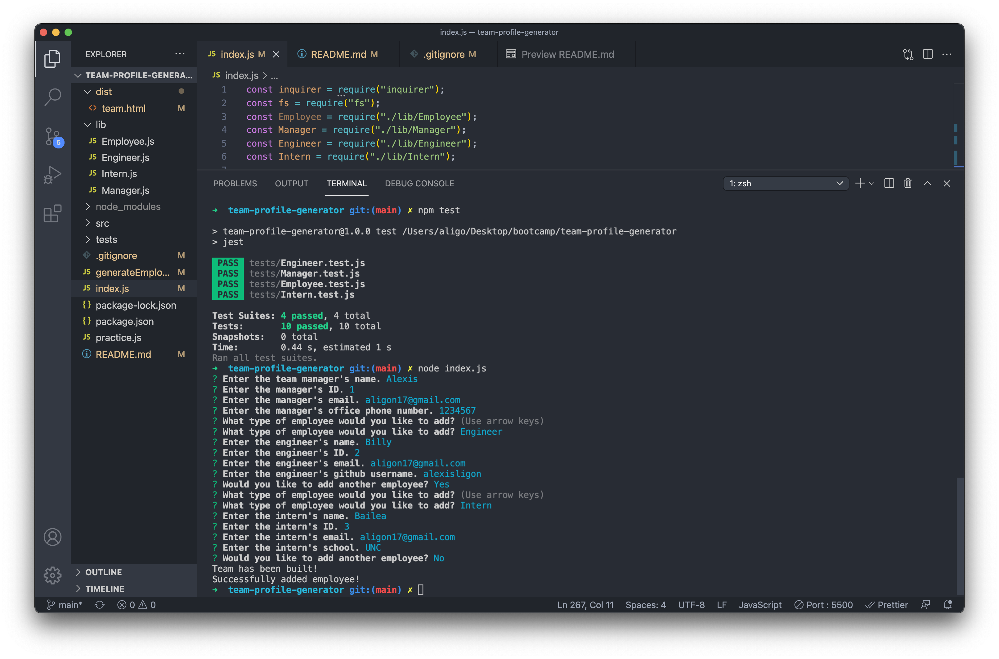
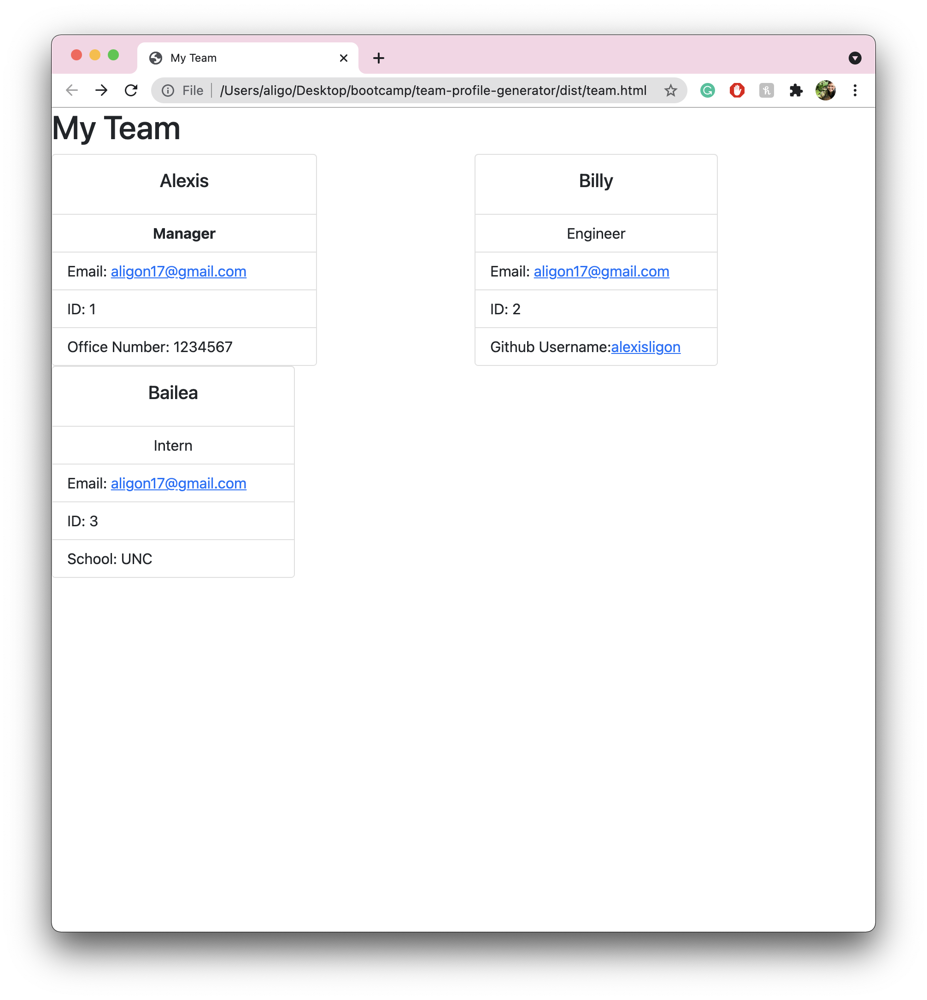

# team-profile-generator
A Node.js command-line application that takes in information about employees on a software engineering team, then generates an HTML webpage that displays summaries for each person. 

[Video Walk-through](https://drive.google.com/file/d/1Ab8aiwMpQpEQNPv3tQJUzIm3z56odemt/view)
[GitHub Repository - Team Profile Generator](https://github.com/alexisligon/team-profile-generator)

## Description

* This application can be ran through the command line by executing 'node index.js'. 

* Inquirer will prompt you through a series of questions to build your team of employees.

* The questions start with information about the manager of the team, and then proceed with adding as many engineers and interns as necessary.

* With each addition of a new employee, the the team.html will be updated with the information that was entered. 

* After completion, the html file is ready to be opened in the server. 

* The team.html located in the dist folder is the team that was built on the video walk-through for an example. 

## Future Development

* Future developemnt includes more implementation of classes and constructor functions within them. As well as breaking up my code so it isn't so convoluted within one index.js file. 

* I would have also liked to push the employees as objects to an array, and looped through the array to create the individual cards for the html file. 

## Image

* This image displays the entire command line application.

* This image displays the dynamically generated HTML on the browser, with clickable links for email and github.

